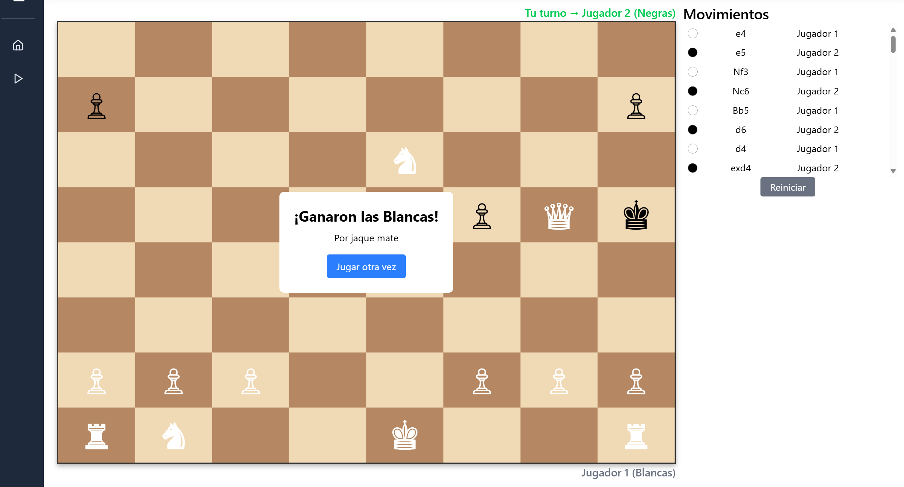

# Chess Game

Este proyecto es una aplicación de ajedrez desarrollada con React, TypeScript y Vite. Permite a los usuarios jugar partidas de ajedrez en un navegador web, con todas las reglas estándar del juego implementadas.

## Características

- Tablero de ajedrez interactivo con piezas tradicionales
- Movimientos legales según las reglas oficiales
- Indicador de turno del jugador (Blancas/Negras)
- Historial de movimientos detallado
- Detección de jaque y jaque mate
- Promoción de peones
- Interfaz de usuario intuitiva con barra lateral colapsable
- Diseño responsive
- Mensajes de fin de partida (victoria, empate)
- Opción para reiniciar el juego en cualquier momento

## Tecnologías utilizadas

- React para la interfaz de usuario
- TypeScript para tipado estático
- Vite como herramienta de construcción
- Lucide React para iconos
- CSS Modules para estilos encapsulados
- chess.js para la lógica del juego

## Cómo ejecutar el proyecto

1. Clona este repositorio
2. Instala las dependencias con `npm install`
3. Ejecuta el servidor de desarrollo con `npm run dev`
4. Abre tu navegador en `http://localhost:5173`

## Estructura del proyecto

- `/src/components`: Componentes de React (incluye Sidebar y otros elementos de UI)
- `/src/page/chessBoard`: Componentes relacionados con el tablero de ajedrez
- `/src/hooks`: Custom hooks de React, incluido useChessGame para la lógica del juego
- `/src/utils`: Funciones de utilidad

## Cómo jugar

1. Las piezas blancas siempre mueven primero
2. Haz clic en una pieza para seleccionarla
3. Haz clic en una casilla válida para mover la pieza seleccionada
4. El juego detectará automáticamente situaciones de jaque, jaque mate y empate
5. Usa el botón "Reiniciar" para comenzar una nueva partida en cualquier momento

## Información de desarrollo

Este proyecto fue creado con Vite. A continuación se muestra información sobre la configuración:

- [@vitejs/plugin-react](https://github.com/vitejs/vite-plugin-react/blob/main/packages/plugin-react/README.md) usa [Babel](https://babeljs.io/) para Fast Refresh
- [@vitejs/plugin-react-swc](https://github.com/vitejs/vite-plugin-react-swc) usa [SWC](https://swc.rs/) para Fast Refresh